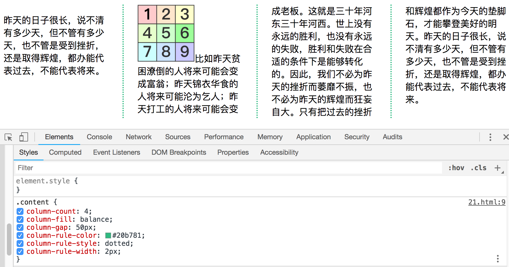
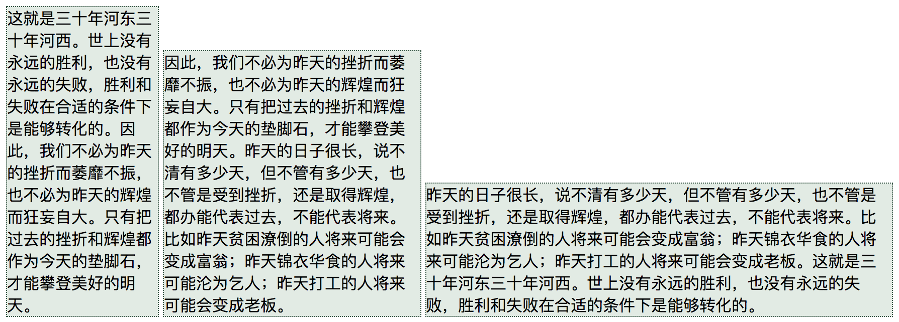
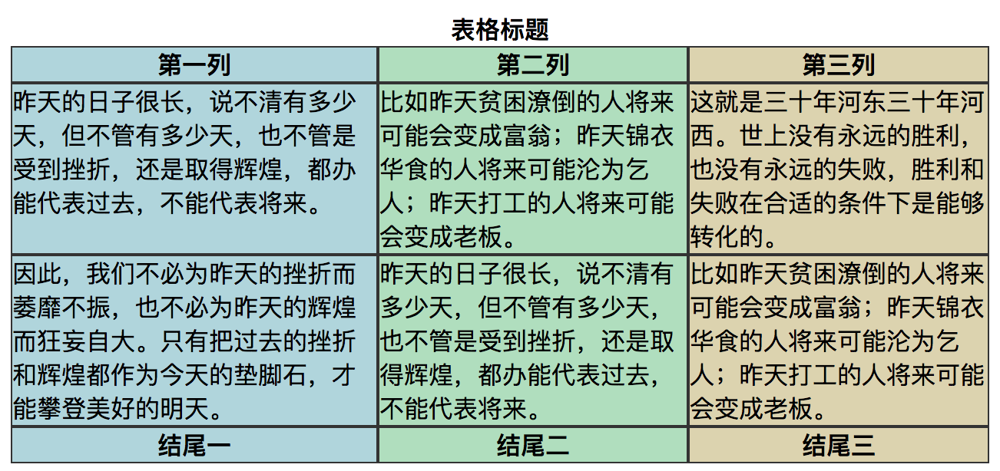

### 定位内容

|属性|说明|值|
|---|---|---|
|position|设置定位方法|static，relative，absolute，fixed|
|left|为定位元素设置向左偏移量|<长度>，<百分比>，auto|
|right|为定位元素设置向右偏移量|<长度>，<百分比>，auto|
|top|为定位元素设置向上偏移量|<长度>，<百分比>，auto|
|bottom|为定位元素设置向下偏移量|<长度>，<百分比>，auto|
|z-index|设置定位元素的层叠顺序|数字|

|值|说明|
|---|---|
|static|元素为普通布局，默认值|
|relative|元素位置相对于普通位置定位|
|absolute|元素相对于position值不为static的第一位祖先元素定位，如果不存在这样元素那就相对于body元素来定位|
|fixed|元素相对于浏览器窗口来定位|

##### absolute与relative区别

`absolute`: 元素相对于position值不为static的第一位祖先元素定位，如果不存在这样元素那就相对于body元素来定位。top，bottom，left，right是相对于父元素的距离。
`relative`: 元素相对于自身来定位，top，bottom，left，right是相对于自身元素的距离。

#### 元素的层叠顺序

`z-index`属性指定元素显示的层叠顺序，属性值是数值，且允许取负数，值越小在层叠顺序中就越靠后，这个属性只有在元素重叠的情况下才会派上用场。

|属性|说明|值|
|---|---|---|
|z-index|设置元素的相对层叠顺序|<数值>，默认值是0|


### 创建多列布局

多列特性允许在多个垂直列中布局内容，跟报纸的排版方式类似。

|属性|说明|值|
|---|---|---|
|column-count|指定列数|<数值>|
|column-fill|指定内容在列与列之间分布的方式，balance指浏览器确保不同列之间的长度差尽可能小。auto则按顺序填充列|balance, auto|
|column-gap|指定列之间的距离|<长度值>|
|column-rule|在一条声明中设置column-rule-*的简写属性|<宽度值><样式><颜色>|
|column-rule-color|设置列之间的颜色规则|<颜色>|
|column-rule-style|设置列之间的样式规则|none, dashed(破折线), dotted(原点式), double(双线式), groove(槽线式), inset(有内嵌效果的边框), outset(有外凸效果的边框), ridge(脊线边框), solid(实线边框)|
|column-rule-width|设置列之间的宽度|<长度值>|
|column|column-span和column-width的简写|<长度值><数值>|
|column-span|指定元素横向能跨多少列|None all|
|column-width|指定列宽，浏览器会通过添加或删除列数维持指定列宽|<长度值>|

```html
<style type="text/css">
  .content {
	column-count: 4;
	column-fill: balance;
	column-gap: 50px;
	column-rule-color: #20b781;
	column-rule-style: dotted;
	column-rule-width: 2px;
  }
</style>
<div class="content">
  <p>昨天的日子很长，说不清有多少天，<span>但不管有多少天，</span>也不管是受到挫折，还是取得辉煌，都办能代表过去，不能代表将来。</p>
  <p>
    比如昨天贫困潦倒的人将来可能会变成富翁；昨天锦衣华食的人将来可能沦为乞人；昨天打工的人将来可能会变成老板。这就是三十年河东三十年河西。世上没有永远的胜利，也没有永远的失败，胜利和失败在合适的条件下是能够转化的。因此，我们不必为昨天的挫折而萎靡不振，也不必为昨天的辉煌而狂妄自大。只有把过去的挫折和辉煌都作为今天的垫脚石，才能攀登美好的明天。昨天的日子很长，说不清有多少天，但不管有多少天，也不管是受到挫折，还是取得辉煌，都办能代表过去，不能代表将来。
  </p>
</div>
```



### 创建弹性盒布局（内容已过时）

实现弹性盒核心功能的三个-webkit属性值：

|属性|说明|值|
|---|---|---|
|box-align|如果内容元素的高度小于容器的高度，告诉浏览器如何处理多余空间|start, end, center, baseline, stretch|
|box-flex|指定元素的可伸缩性，应用于`弹性盒容器内`的元素|<数值>|
|box-pack|如果可伸缩元素达到最大尺寸，告诉浏览器如何分配空间|start, end, center, justify|

#### 伸缩多个元素

`box-flex`属性告诉浏览器伸缩多少个尺寸，是个比例值，根据比例值来分配多余空间。

#### 处理垂直空间

`box-align`属性告诉浏览器如何处理多余的垂直空间。

属性值：

|值|说明|
|---|---| 
|start|元素沿容器的顶边放置，任何空空间都在其下方显示|
|end|元素沿容器的底边放置，任何空空间都在其上方显示|
|center|多余的空间被平分为两部分，分别显示在元素的上方和下方|
|strech|调整元素的高度，以填充可用空间|

#### 处理最大尺寸

弹性盒模型伸缩时不会超过内容元素的最大尺寸值，如果存在多余空间，浏览器会伸展元素，直到达到最大延伸尺寸。`box-pack`属性定义了在所有的可伸缩元素均达到最大尺寸的情况下，多余空间仍未分配完毕时应该如何处理。

属性值：

|值|说明|
|---|---|
|start|元素从左边界开始放置，任何未分配的空间显示到最后一个元素的右边|
|end|元素从右边界开始放置，任何未分配的空间显示到第一个元素的左边|
|center|多余空间平均分配到第一个元素的左边和最后一个元素的右边|
|justify|多余空间均匀分配到各个元素之间|

```html
<style type="text/css">
  .container {
	display: -webkit-box;  /* 弹性盒模型 */
	-webkit-box-align: end;  /* 垂直空间 */
	-webkit-box-direction: reverse;  /* 顺序 */
	-webkit-box-pack: center;  /* 多余空间分配 */
  }
  p {
	width: 150px;
	border: 1px dotted #395648;
    background: #e2eae4;
	margin: 2px;
  }
  .first {
	-webkit-box-flex: 3;
  }
  .second {
	-webkit-box-flex: 1;
  }
  .third {
	width: 150px;
  }
</style>
<div class="container">
  <p class="first">
	昨天的日子很长，说不清有多少天，但不管有多少天，也不管是受到挫折，还是取得辉煌，都办能代表过去，不能代表将来。比如昨天贫困潦倒的人将来可能会变成富翁；昨天锦衣华食的人将来可能沦为乞人；昨天打工的人将来可能会变成老板。这就是三十年河东三十年河西。世上没有永远的胜利，也没有永远的失败，胜利和失败在合适的条件下是能够转化的。
  </p>
  <p class="second">
    因此，我们不必为昨天的挫折而萎靡不振，也不必为昨天的辉煌而狂妄自大。只有把过去的挫折和辉煌都作为今天的垫脚石，才能攀登美好的明天。昨天的日子很长，说不清有多少天，但不管有多少天，也不管是受到挫折，还是取得辉煌，都办能代表过去，不能代表将来。比如昨天贫困潦倒的人将来可能会变成富翁；昨天锦衣华食的人将来可能沦为乞人；昨天打工的人将来可能会变成老板。
  </p>
  <p class="third">
    这就是三十年河东三十年河西。世上没有永远的胜利，也没有永远的失败，胜利和失败在合适的条件下是能够转化的。因此，我们不必为昨天的挫折而萎靡不振，也不必为昨天的辉煌而狂妄自大。只有把过去的挫折和辉煌都作为今天的垫脚石，才能攀登美好的明天。
  </p>
</div>
```


### 创建表格布局

css表格布局的一个优点是自动调整单元格大小，行是由该行中内容最高的单元格决定的，列是由该列中内容最宽的单元格决定。

与表格布局相关的display属性值：

|值|说明|
|---|---|
|table|类似table元素|
|inline-table|类似table元素，但是创建一个行内元素|
|table-caption|类似caption元素|
|table-column|类似col元素|
|table-column-group|类似colgroup元素|
|table-header-group|类似thead元素|
|table-row-group|类似tbody元素|
|table-footer-group|类似tfoot元素|
|table-row|类似tr元素|
|table-cell|类似td元素|

```html
<style type="text/css">
  .table {
	display: table;
  }
  .caption {
	display: table-caption;
  }
  .colgroup {
	display: table-column-group;
  }
  .col-1, .col-2, .col-3 {
	display: table-column;
  }
  .col-1 {
	background: #afd4dc;
  }
  .col-2 {
	background: #afdcbe;
  }
  .col-3 {
	background: #dcd2af;
  }
  .thead {
	display: table-header-group;
  }
  .tbody {
	display: table-row-group;
  }
  .tr {
	display: table-row;
  }
  .tr p {
	display: table-cell;
	border: 1px solid #333;
  }
  .tfoot {
	display: table-footer-group;
  }
  .caption, .thead, .tfoot {
	text-align: center;
	font-weight: 600;
  }
</style>
<div class="table">
  <div class="caption">表格标题</div>
  <div class="colgroup">
	<div class="col-1"></div>
	<div class="col-2"></div>
	<div class="col-3"></div>
  </div>
  <div class="thead">
	<div class="tr">
		<p>第一列</p>
		<p>第二列</p>
		<p>第三列</p>
	</div>	
  </div>
  <div class="tbody">
	<div class="tr">
	  <p>昨天的日子很长，说不清有多少天，但不管有多少天，也不管是受到挫折，还是取得辉煌，都办能代表过去，不能代表将来。</p>
	  <p>比如昨天贫困潦倒的人将来可能会变成富翁；昨天锦衣华食的人将来可能沦为乞人；昨天打工的人将来可能会变成老板。</p>
	  <p>这就是三十年河东三十年河西。世上没有永远的胜利，也没有永远的失败，胜利和失败在合适的条件下是能够转化的。</p>
    </div>	
	<div class="tr">
	  <p>因此，我们不必为昨天的挫折而萎靡不振，也不必为昨天的辉煌而狂妄自大。只有把过去的挫折和辉煌都作为今天的垫脚石，才能攀登美好的明天。</p>
	  <p>昨天的日子很长，说不清有多少天，但不管有多少天，也不管是受到挫折，还是取得辉煌，都办能代表过去，不能代表将来。</p>
	  <p>比如昨天贫困潦倒的人将来可能会变成富翁；昨天锦衣华食的人将来可能沦为乞人；昨天打工的人将来可能会变成老板。</p>
    </div>
  </div>
  <div class="tfoot">
	<div class="tr">
      <p>结尾一</p>
	  <p>结尾二</p>
	  <p>结尾三</p>
	</div>
  </div>
</div>
```
