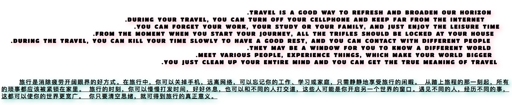

### 文本样式

#### 文本对齐

|属性|说明|值|
|---|---|---|
|text-align|指定文本块的对齐方式|start, end, left, right, center, justify|
|text-justify|指定文本添加空白的方式，如果text-align属性使用了justify值，则该值会用来指定对齐文本的规则||

`text-justify`属性值：

|值|说明|
|---|---|
|auto|浏览器选择对齐规则，不同浏览器之间的呈现方式会有微小差别|
|none|禁用文本对齐|
|inter-word|空白分布在单词之间，适用于英语等词间有空的语言|
|inter-ideograph|空白分布在单词、表意字之间，且文本两端对齐，适用于汉语、日文和韩文等语言|
|inter-cluster|空白分布在单词、字形集的边界，适用于泰文等无词间空格的语言|
|distribute|空白分布在单词、字形集的边界，但连续文或者草体除外|
|kashida|通过拉长选定字符调整对齐方式（仅适用于草体）|

#### 处理空白

空白在HTML文档中通常是被压缩或者直接忽略掉，浏览器遇到多个空格时，会将它们压缩为一个空格，而换行符等其他空白符则会直接被忽略。

|属性|说明|值|
|---|---|---|
|white-space|指定空白字符的处理方式||

`white-space`属性值：

|值|说明|
|---|---|
|normal|默认值，空白符被压缩，文本行自动换行|
|nowrap|空白符被压缩，文本行不换行|
|pre|空白符被保留，文本只在遇到换行符的时候换行，跟pre元素效果一样|
|pre-line|空白符被压缩，文本会在一行排满或遇到换行符时换行|
|pre-wrap|空白符被保留，文本会在一行排满或遇到换行符时换行|

#### 文本方向

`direction`属性告诉浏览器文本块的排列方向。

|属性|说明|值|
|---|---|---|
|direction|设置文本方向|ltr（靠左），rtl（靠右）|

#### 单词、字母、行之间的间距

间距属性：

|属性|说明|值|
|---|---|---|
|letter-spacing|设置字母之间的距离|normal，<长度值>|
|word-spacing|设置单词之间的距离|normal，<长度值>|
|line-height|设置行高|normal，<长度值>， <数值>，<%>|

#### 控制断词

`word-wrap`属性告诉浏览器当一个单词的长度超出包含块的宽度时如何处理。

|属性|说明|值|
|---|---|---|
|word-wrap|控制断词|normal, break-word|


|值|说明|
|---|---|
|normal|单词不断开，即使无法完全放入包含块元素|
|break-word|断开单词，使其放入包含块中|

#### 首行缩进

`text-indent`属性用于指定文本块首行缩进，值可以是长度值，也可以是相对于元素宽度的百分数值。

|属性|说明|值|
|---|---|---|
|text-indent|设置文本首行的缩进|<长度值>，<%>|

#### 文本装饰

|属性|说明|值|
|---|---|---|
|text-decoration|为文本块应用装饰效果|none, underline, overline, line-through, blink|

#### 大小写转换

|属性|说明|值|
|---|---|---|
|text-transform|为文本块转换大小写|none, capitalize, uppercase, lowercase|

#### 文本阴影

|属性|说明|值|
|---|---|---|
|text-shadow|为文本块应用阴影|<h-shadow>(水平偏移), <v-shadow>(垂直偏移), < blur>(阴影的模糊程度), < color>(阴影的颜色)|


### 使用字体

|属性|说明|值|
|---|---|---|
|font-family|指定文本块采用的字体名称|serif, sans-serif, cursive, fantasy, monospace|
|font-size|指定文本块的字体大小|xx-small, x-small, small, medium, large, x-large, xx-large, smaller, larger, <数值>, <百分比>|
|font-style|指定字体样式|normal, italic, oblique|
|font-variant|指定字体是否以小型大写字母显示|normal, smallcaps|
|font-weight|设置字体粗细|normal, bold, bolder, lighter, 100~900之间的数字|
|font|属性简写|顺序：style variant weight size family|

`font-family`属性指定使用的字体，按照优先顺序排列，浏览器从字体列表中的第一种开始尝试，知道发现合适的字体为止。

### 使用Web字体

使用@font-face指定下载的web字体，使用在自己的页面上。使用@font-face的时候，需要使用标准字体属性来描述正在使用的字体。src属性来指定字体文件位置。

```html
<style type="text/css">
  @font-face {
	font-family: 'MyFont';
	src: url('./font.woff2');
  }
  .english, .chiness {
	text-align: justify;  /* 对齐文本 */
	letter-spacing: 2px;  /* 设置字母之间的距离 */
	word-spacing: 4px;  /* 设置单词之间的距离 */
	line-height: 20px;  /* 设置行高 */
	word-wrap: break-word;  /* 控制断词 */
  }
  .english {
	white-space: pre;  /* 文本空白 */
	direction: rtl;  /* 文本方向 */
	text-transform: uppercase;  /* 大小写转换(转换为大写) */
	text-shadow: 5px 5px 20px #ffc0cb;  /* 文本阴影 */
	font-family: MyFont;
  }
  .chiness {
	text-indent: 50px;  /* 首行缩进 */
	text-decoration: underline;  /* 文本装饰 */
	text-shadow: 5px 5px 20px #68d0c5;  /* 文本阴影 */
	font-weight: 600;  /* 字体粗细 */
  }
</style>
<p class="english">
  Travel is a good way to refresh and broaden our horizon. 
  During your travel, you can turn off your cellphone and keep far from the Internet. 
  You can forget your work, your study or your family, and just enjoy the leisure time. 
  From the moment when you start your journey, all the trifles should be locked at your house. 
  During the travel, you can kill your time slowly to have a good rest, and you can contact with different people. 
  They may be a window for you to know a different world. 
  Meet various people, experience things, which make your world bigger. 
  You just clean up your entire mind and you can get the true meaning of travel.
</p>
<p class="chiness">
  旅行是消除疲劳开阔眼界的好方式。在旅行中，你可以关掉手机，远离网络，可以忘记你的工作、学习或家庭，只需静静地享受旅行的闲暇。
  从踏上旅程的那一刻起，所有的琐事都应该被紧锁在家里。
  旅行的时刻，你可以慢慢打发时间，好好休息，也可以和不同的人打交道，这些人可能是你开启另一个世界的窗口。遇见不同的人，经历不同的事，这都可以使你的世界更宽广。
  你只要清空思绪，就可得到旅行的真正意义。
</p>
```
