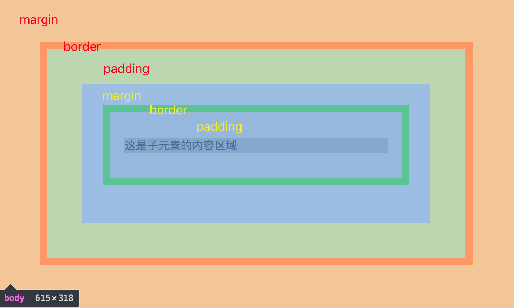
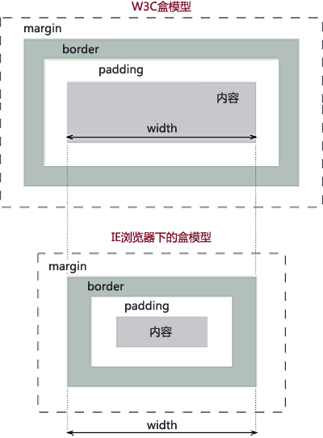

## 盒模型
在模块还不太稳定的阶段，浏览器会采用厂商前缀实现某个特征。  

* -webkit-: Chrome、Safari
* -o-: Opera
* -moz-: Firefox
* -ms-: Internet Explorer

盒模型（box model），盒模型两部分组成：内容和边框。

                    

### W3C盒模型和IE盒模型区别：

    W3C模型中：
      CSS中的宽（width）=内容（content）的宽
      CSS中的高（height）=内容（content）的高
    IE模型中：
      CSS中的宽（width）=内容（content）的宽+（border+padding）*2
      CSS中的高（height）=内容（content）的高+（border+padding）*2

解决：
在IE8及以下的浏览器中只支持IE盒模型，在IE8+及其他主流浏览器中，通过CSS新增的box-sizing属性可以设置浏览器的盒模型。box-sizing属性的默认值是content-box，即W3C标准盒模型；而将box-sizing值设置为border-box时，则会更改为IE盒模型。
box-sizing ： content-box | border-box | inherit

  - content-box : 让元素采用标准的W3C盒模型。
  - border-box：让元素采用IE盒模型。
  - inherit：让元素继承父元素的`box-sizing`属性

* 避免触发IE盒模型的方法是使用<!DOCTYPE html>声明，告诉IE采用W3C盒子模型即可。