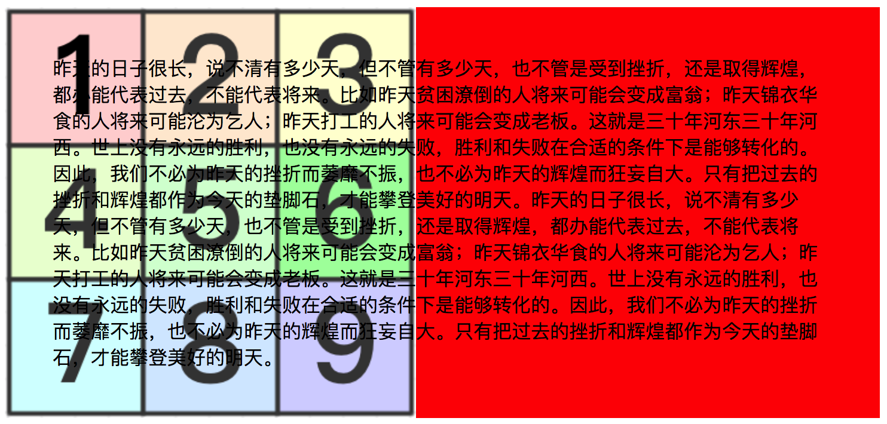
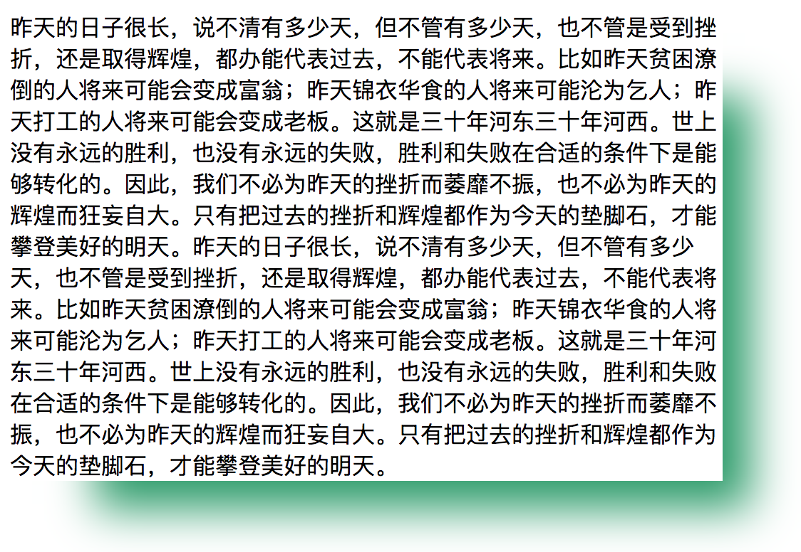
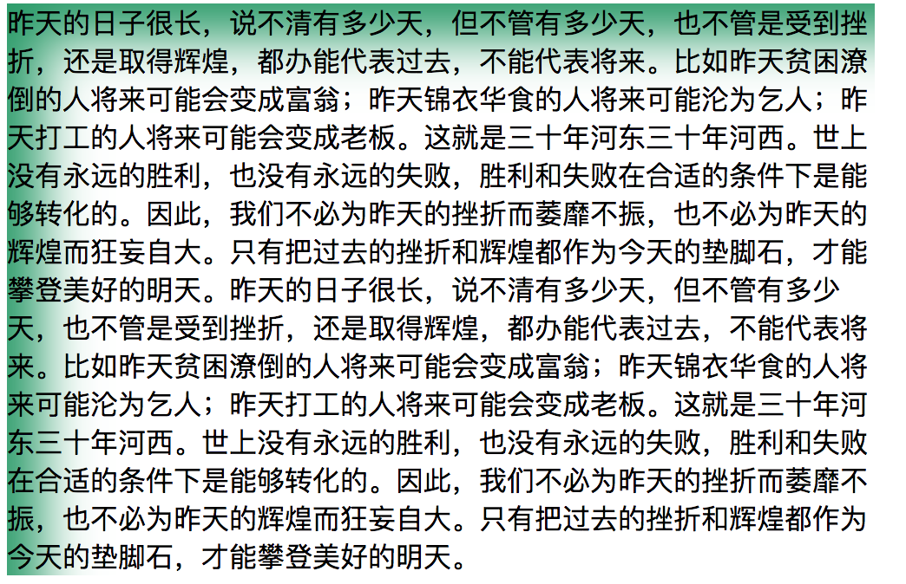
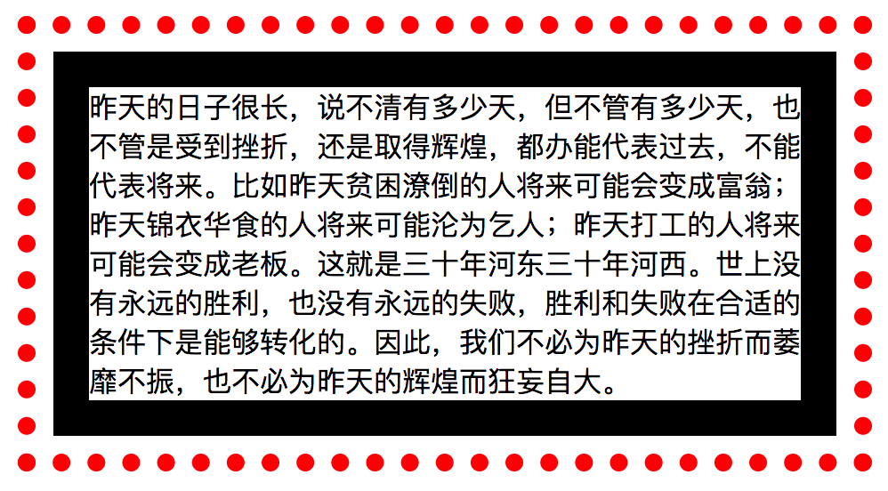

### 属性

|属性|说明|值|
|---|---|---|
|background-color|设置元素的背景颜色，总是显示在背景图下面|<颜色>|
|background-image|设置元素的背景图像，如果指定一个以上的图像，则后面图像绘制在前面图像下面||
|background-repeat|设置图像的重复样式||
|background-size|设置背景图像的尺寸||
|background-postion|设置背景图像的位置||
|background-attachment|设置元素中的图像是否固定或随页面一起滚动||
|background-clip|设置背景图像裁剪方式||
|background-origin|设置背景图像绘制的起始位置||
|background|属性缩写|顺序为：<br> color, <br>postion, <br>size, <br>repeat, <br>origin, <br>clip, <br>attchement, <br>image|


#### background-repeat属性
图像的重复方式

|值|说明|
|---|---|
|repeat-x|水平方向平铺图像，图像可能被截断|
|repeat-y|垂直方向平铺图像，图像可能被截断|
|repeat|水平和垂直方向同时平铺图像，图像可能被截断|
|space|水平或者垂直方向平铺图像，但在图像与图像之间设置统一间距，确保图像不被截断|
|no-repeat|禁止平铺图像|


#### background-size属性
将图像调整为指定大小，可以使用长度值、百分比（图像的宽度和高度相关）、预定义值。

预定义值：

|值|说明|
|---|---|
|contain|等比例缩放图像，使其宽度、高度中较大者与容器横向或纵向重合，背景图像始终包含在容器内|
|cover|等比例缩放图像，使图像至少覆盖容器，有可能超出容器|
|auto|默认值，图像以本身尺寸完全显示|

contain值确保图像调整尺寸后，整个图像始终包含在元素内。浏览器判断图像长度和高度哪个更大，并将较大者调整至容器相应宽度和高度大小。
cover值，浏览器选中较小的值，并沿着该方向调整图像的大小。

#### background-position属性

设置背景图像的位置，可以使用长度单位，也可以使用预定义值。

|值|说明|
|---|---|
|top|将背景图像定位到盒子顶部边界|
|left|将背景图像定位到盒子左边界|
|right|将背景图像定位到盒子右边界|
|bottom|将背景图像定位到盒子底部边界|
|center|将背景图像定位到中间位置|

第一个值是垂直位置，可以是top、bottom和center，第二个值控制水平位置,可以是left、right和center。


#### background-attachment属性
指定背景附着内容的方式。

|值|说明|
|---|---|
|fixed|背景固定到视窗上，即内容滚动时背景不动|
|local|背景附着到内容上，即背景随内容一起滚动|
|scroll|背景固定到元素上，不会随内容一起滚动|


#### background-origin和background-clip属性
背景的起始点（origin）指定背景颜色和背景图像应用的位置。background-clip属性决定了背景哪一部分是可见的。裁剪（clip）样式决定了背景颜色和图像在元素盒子中绘制的区域，裁剪盒子之外的部分一律丢弃。

两者取值如下：

|值|说明|
|---|---|
|border-box|在边框盒子内部绘制背景颜色和背景图像|
|padding-box|在内边距盒子内部绘制背景颜色和背景图像|
|content-box|在内容盒子内部绘制背景颜色和背景图像|

示例代码：
```html
<style type="text/css">
  p {
	background-color: red;
	background-image: url(test.png);
	background-repeat: no-repeat;
	background-size: contain;
	background-position: 0px 0px;
	background-attachment: local;
	background-origin: border-box;
	background-clip: border-box;
	padding: 20px;
    border-width: 20px;
    border-style: solid;
    border-color: transparent;
  }
</style>
<p>
昨天的日子很长，说不清有多少天，但不管有多少天，也不管是受到挫折，还是取得辉煌，都办能代表过去，不能代表将来。比如昨天贫困潦倒的人将来可能会变成富翁；
昨天锦衣华食的人将来可能沦为乞人；昨天打工的人将来可能会变成老板。这就是三十年河东三十年河西。世上没有永远的胜利，也没有永远的失败，
胜利和失败在合适的条件下是能够转化的。因此，我们不必为昨天的挫折而萎靡不振，也不必为昨天的辉煌而狂妄自大。只有把过去的挫折和辉煌都作
为今天的垫脚石，才能攀登美好的明天。昨天的日子很长，说不清有多少天，但不管有多少天，也不管是受到挫折，还是取得辉煌，都办能代表过去，
不能代表将来。比如昨天贫困潦倒的人将来可能会变成富翁；昨天锦衣华食的人将来可能沦为乞人；昨天打工的人将来可能会变成老板。这就是三十年
河东三十年河西。世上没有永远的胜利，也没有永远的失败，胜利和失败在合适的条件下是能够转化的。因此，我们不必为昨天的挫折而萎靡不振，
也不必为昨天的辉煌而狂妄自大。只有把过去的挫折和辉煌都作为今天的垫脚石，才能攀登美好的明天。
</p>
```



### 盒子阴影

通过 `box-shadow`属性实现为元素添加阴影效果。
`box-shadow`组成值如下：
```css
box-shadow: hoffset voffset blur spread color inset
```

|值|说明|
|---|---|
|hoffset|阴影的水平偏移量，是一个长度值，正值代表阴影向右偏移，负值代表阴影向左偏移|
|voffset|阴影的垂直偏移量，是一个长度值，正值代表阴影位于元素盒子下方，负值代表阴影位于元素盒子上方|
|blur|(可选)指定模糊值，是一个长度值，值越大盒子的边界越模糊。默认值为0，边界清晰|
|spread|(可选)指定阴影的延伸半径，是一个长度值，正值代表阴影向盒子各个方向延伸扩大，负值代表阴影沿相反方向缩小|
|color|(可选)设置阴影的颜色，如果省略，浏览器会自行选择一个颜色|
|inset|(可选)将外部阴影设置为内部阴影(内嵌到盒子中)|

示例：
```js
box-shadow: 40px 40px 50px -20px #259a6b;
```

阴影内嵌:
```js
box-shadow: 40px 40px 50px -20px #259a6b inset;
```



### 应用轮廓

轮廓对于边框来说是可选的，轮廓绘制于盒子边框外面。边框和轮廓最大的区别是：轮廓不属于页面，应用轮廓不需要调整页面布局。

轮廓属性:
|属性|说明|值|
|---|---|---|
|outline-color|设置外围轮廓的颜色|<颜色>|
|outline-offset|设置轮廓距离元素边框边缘的偏移量|<长度>|
|outline-style|设置轮廓样式|none, dashed, dotted, double, groove, inset, outset, ridge, solid|
|outline-width|设置轮廓的宽度|thin, medium, thick, <长度>|
|outline| 缩写 | <颜色> <样式> <宽度> |

代码示例：
```html
<style type="text/css">
p {
  border-width: 20px;
  border-style: solid;
  width: 400px;
  outline-color: red;
  outline-offset: 10px;
  outline-style: dotted;
  outline-width: 10px; 
}
</style>
  <p>
    昨天的日子很长，说不清有多少天，但不管有多少天，也不管是受到挫折，还是取得辉煌，都办能代表过去，不能代表将来。比如昨天贫困潦倒的人将来可能会变成富翁；昨天锦衣华食的人将来可能沦为乞人；昨天打工的人将来可能会变成老板。这就是三十年河东三十年河西。世上没有永远的胜利，也没有永远的失败，胜利和失败在合适的条件下是能够转化的。因此，我们不必为昨天的挫折而萎靡不振，也不必为昨天的辉煌而狂妄自大。
  </p>
</body>
```
