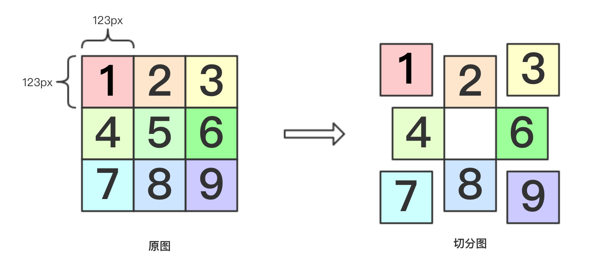

### 基本属性

|属性|说明|值|
|---|---|---|
|border-width|设置边框的宽度|<长度值>,thin,medium(默认),thick|
|border-style|设置边框样式| none, <br>dashed(破折线), <br>dotted(原点式), <br>double(双线式), <br>groove(槽线式), <br>inset(有内嵌效果的边框), <br>outset(有外凸效果的边框), <br>ridge(脊线边框), <br>solid(实线边框)|
|border-color|边框的颜色|<颜色>|
|border-top-width|上边框宽度||
|border-top-style|上边框样式||
|border-top-color|上边框颜色||
|border-bottom-width|下边框宽度||
|border-bottom-style|下边框样式||
|border-bottom-color|下边框颜色||
|border-left-width|左边框宽度||
|border-left-style|左边框样式||
|border-left-color|左边框颜色||
|border-right-width|右边框宽度||
|border-right-style|右边框样式||
|border-right-color|右边框颜色||
|border|属性简写|<宽度>，<样式>，<颜色>|


### 圆角边框

radius特性创建圆角边框，指定两个半径值即可定义一个圆角，采用长度值和百分比值均可，第一个值指定水平曲线半径，第二个值指定垂直曲线半径。
```css
border-radius: 20px / 15px;
border-radius: 50% 20px 25% 5em / 25% 15px 40px 55%;  /* 四个角水平半径/四个角垂直半径 */
```
|属性|说明|值|
|---|---|---|
|border-radius|圆角边框|一对或四对长度值或百分数值，由/字符分割|
|border-top-radius||一对长度值或百分数值，由/字符分割|
|border-bottom-radius||一对长度值或百分数值，由/字符分割|
|border-left-radius||一对长度值或百分数值，由/字符分割|
|border-right-radius||一对长度值或百分数值，由/字符分割|


### 图像用做边框

|属性|说明|值|
|---|---|---|
|border-image-source|设置图像来源|none或者url(<图像>)|
|border-image-slice|设置切分图像的偏移|1~4个长度值或者百分数，受图像的宽度和高度影响|
|border-image-width|设置图像边框的宽度|auto或1~4个长度值或者百分数|
|border-image-outset|指定边框图像向外扩展的部分|1~4个长度值或者百分数|
|border-image-repeat|设置图像填充边框区域的模式|stretch、repeat和round中的一个或两个值|
|border-image|所有值的简写||

#### 切分图像

将图像用做边框的关键是切分图像，指定图像边框向内偏移值，浏览器会使用这些值来将图像切分为9块。要切分图像应该提供图像边框在四个方向上的向内偏移的值，用长度值或者相对图像尺寸的百分比数表示均可。可以提供四个值，两个值（水平方向和垂直方向），一个值。
示例：

该图像为369px * sp9px,每个切分图为30px * 30px。中间的切分图时透明的，切分后生成8个切分图。标记为1，3，7，9的切图分别绘制边框的四个角，标记为2，4，6，8的切图分别用来绘制边框的四条边。切分值和边框宽度值之间使用/字符进行分割。

#### 控制切分图重复样式
为填满边框的整个空间，位于边框的切分图被拉伸。`border-image-repeat``属性可以改变图像的重复方式，可以设置两个值（第一个值指定水平重复样式，第二个值指定垂直重复样式），设置一个值（水平，垂直重复样式一样）。
|值|说明|
|---|---|
|stretch|拉伸切分图填满整个空间，默认值|
|repeat|平铺切分图填满整个空间（可能导致图片被截断）|
|round|在不截断切分图的情况下，平铺切分图并拉伸以填满整个空间|
|space|在不截断切分图的情况下，平铺切分图并在图片之间保留一定的间距以填满整个空间|

```js
<!DOCTYPE>
<html>
  <head>
	<meta chartset="utf-8">
	<style type="text/css">
	  p {
	    /* 图片来源 切分值 / 边框宽度值 上下边框重复方式 左右边框重复方式 */
	    -webkit-border-image: url(test.png) 123 123 123 123/ 50px round repeat;
		-moz-border-image: url(test.png) 123 / 50px round repeat;
		-o-border-image: url(test.png) 123 / 50px;
	  }
	</style>
  </head>
  <body>
    <p>
	  昨天的日子很长，说不清有多少天，但不管有多少天，也不管是受到挫折，还是取得辉煌，都办能代表过去，
	  不能代表将来。比如昨天贫困潦倒的人将来可能会变成富翁；昨天锦衣华食的人将来可能沦为乞人；
	  昨天打工的人将来可能会变成老板。这就是三十年河东三十年河西。世上没有永远的胜利，也没有永远的失败，
	  胜利和失败在合适的条件下是能够转化的。因此，我们不必为昨天的挫折而萎靡不振，也不必为昨天的辉煌而狂妄自大。
	  只有把过去的挫折和辉煌都作为今天的垫脚石，才能攀登美好的明天。昨天的日子很长，说不清有多少天，
	  但不管有多少天，也不管是受到挫折，还是取得辉煌，都办能代表过去，不能代表将来。比如昨天贫困潦倒的人
	  将来可能会变成富翁；昨天锦衣华食的人将来可能沦为乞人；昨天打工的人将来可能会变成老板。这就是三十年
	  河东三十年河西。世上没有永远的胜利，也没有永远的失败，胜利和失败在合适的条件下是能够转化的。
	  因此，我们不必为昨天的挫折而萎靡不振，也不必为昨天的辉煌而狂妄自大。只有把过去的挫折和辉煌都作
	  为今天的垫脚石，才能攀登美好的明天。
    </p>
  </body>
</html>
```
chrome图像边框效果：


火狐图像边框效果：
