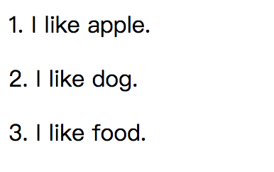

### 基本选择器

|选择器|详情|说明|示例|
|---|:---:|---|---|
|*||选择所有元素| * { }|
|<元素类型>||根据类型选择元素| a { }|
|<类名> （*.<类名>）（<元素类型>.类名）||根据类元素选择|.class1 { } span.class2{ }|
|#<id值> （<元素类型>#<id值>）||根据ID选择元素|  \#id1 { }  p#id2 { }|
|[attr] | 选择定义attr属性元素，忽略属性值| 根据属性选择元素|[href] { } |
|[attr="val"] | 选择定义attr属性，且属性值为val元素||[href="www"] { }|
|[attr^="val"] | 选择定义attr属性，且属性值以字符串val打头的元素|||
|[attr$="val"] | 选择定义attr属性，且属性值以字符串val结尾的元素|||
|[attr*="val"] | 选择定义attr属性，且属性值包含字符串val的元素|||
|[attr~="val"] | 选择定义attr属性，且属性值具有多个值，其中一个为字符串val的元素|||
|[attr\|="val"] | 选择定义attr属性，且属性值为连字符分割的多个值，其中第一个字符串val的元素||[lang\|="en"]|


### 复合选择器

|选择器|详情|说明|示例|
|---|:---:|---|---|
|<选择器>，<选择器>，<选择器>|单个选择器匹配的所有元素的并集|并集选择器|a, [lang\|="en"] { }|
|<第一个选择器><第二个选择器>| 目标元素紧跟匹配第一个选择器的元素的后代，且匹配第二个选择器|后代选择器|p span { }|
|<第一个选择器> > <第二个选择器>| 目标元素紧跟匹配第一个选择器的元素的直接后代，且匹配第二个选择器|选择子元素| body > * > span, tr > th { } |
|<第一个选择器> + <第二个选择器>|目标元素紧跟匹配第一个选择器元素，且匹配第二选择器|选择兄弟元素|p+a { }|
|<第一个选择器> ～ <第二个选择器>|目标元素位于匹配第一个选择器的元素之后，且匹配第二个选择器|普通兄弟选择器|p ~ a { }|


### 伪元素选择器

伪类伪元素区别，w3c定义：

* CSS 伪类用于向某些选择器添加特殊的效果。
* CSS 伪元素用于将特殊的效果添加到某些选择器。
css3规定写法：

```js
:Pseudo-classes  // 伪类
::Pseudo-elements  // 伪元素
```

因为兼容性的问题，所以现在大部分还是统一的单冒号。

伪选择器（pseudo-selector）提供了更丰富的功能，但并非直接对应HTML文档定义的元素。伪选择器分为：伪元素和伪类。伪元素实际并不存在，它们是CSS提供的额外福利，为了方便选中文档内容。

|选择器|详情|说明|示例|
|---|:---:|---|---|
|::first-line|文本内容的首行|伪元素||
|::first-letter|文本块的首字母|伪元素||
|:before|选中元素的`内容`之前插入|伪元素|a:before { content: "Click herr to"; } content可以指定要插入的内容，只能跟伪选择器一起使用|
|:after|选中元素的`内容`之后插入|伪元素|a:after { content: "!"; }|


#### CSS计数器
创建计数器，使用counter-reset属性为计数器设置名称。计数器初始化后能够作为content属性值，跟:before和:after选择器一起使用来指定样式。

* counter-reset：为计数器设置名称，默认值为1
* counter：计数器默认值表示十进制整数，也可指定其他格式，counter(paracount, lower-alpha)
* counter-increment：设置计数器增量，默认增量为1。自行指定增量为2：counter-increment: paracount 2;

```html
/* CSS计数器 */
<body>
    <p>I like apple.</p>
    <p>I like dog.</p>
    <p>I like food.</p>
    
    <style type="text/css">
        body {
            counter-reset: paracount;  /* 为计数器设置名称，初始值为1  */
            /*counter-reset: paracount 10;  !* 设置计数器值为10 *!*/
        }
        p:before {
            content: counter(paracount) ". ";
            counter-increment: paracount;
        }
    </style>
</body>
```
效果：



### 结构性伪类选择器

结构性伪类选择器能够根据元素在文档中的位置选择元素。这类选择器都有一个冒号字符前缀（:），可以单独使用，也可以跟其他选择器组合使用。

|选择器|详情|说明|示例|
|---|:---:|---|---|
|:root|匹配文档中的根元素，返回HTML元素|根元素选择器|:root { }|
|:first-child|选择元素中的第一个子元素|子元素选择器||
|:last-child|选择元素中的最后一个子元素|子元素选择器|:last-child { } 对body元素也生效，应为body元素是html的最后一个子元素|
|:only-child|匹配父元素包含的唯一子元素|子元素选择器||
|:only-of-child|匹配父元素定义类型的唯一子元素|子元素选择器|包含body元素|
|:nth-child(n)|选择父元素的第n个子元素(索引从1开始)|:nth-child选择器|body > :nth-child(2)|
|:nth-last-child(n)|选择父元素的倒数第n个子元素|:nth-child选择器|body > :nth-last-child(2)|
|:nth-of-type(n)|选择父元素定义类型的第n个子元素|:nth-child选择器|body > :nth-of-type(2)|
|:nth-last-of-type(n)|选择父元素定义类型的倒数第n个子元素|:nth-child选择器|body > :nth-last-of-type(2)|

```html
<style type="text/css">
.text > span:nth-child(2) {
	color: yellow;
	font-size: 40px;
}
</style>
<p class="text">
    I like <span>apples</span> and <span>oranges</sapn>.
</p>
```


### UI伪类选择器
UI伪类选择器可以根据元素的状态匹配元素。

|选择器|详情|说明|示例|
|---|:---:|---|---|
|:enabled|选择启用状态的元素|伪类||
|:disabled|选择禁用状态的元素|伪类||
|:checked|选择被选中的input元素（单选按钮和复选框）|伪类||
|:default|选择默认元素||例：提交按钮总是表单的默认元素|
|:valid|输入验证有效的input元素|伪类||
|:invalid|输入验证无效的input元素|||
|:in-range|选择在指定范围之内受限的input元素|伪类||
|:out-of-range|选择在指定范围之外受限的input元素|伪类||
|:required|根据允许required属性选择input元素|伪类||
|:optional|根据不允许required属性选择input元素|伪类||

代码示例：
```html
<!DOCTYPE>
<html>
	<head>
		<style type="text/css">
			:enabled {  /* 启用状态元素 */
				border: thin black solid;
				padding: 4px;
			}
			:disabled {  /* 禁用状态元素 */
				background: #cccccc;
				color: red;
			}
			:checked + span {  /* 已勾选元素 */
				color: red;
			}
			:default {  /* 默认元素 */
				outline: 1px solid red;
			}
			:valid {  /* 有效的input元素 */
				color: green;
			}
			:invalid {  /* 无效的input元素 */
				color: red;
			}
			:in-range {  /* 位于指定范围的input元素 */
				outline: 5px solid green;
			}
			:out-of-range {  /* 超出指定范围的input元素 */
				outline: 5px solid orange;
			}
			:required {  /* 匹配具有required属性的input元素 */
				background: red;
			}
			:optional {  /* 匹配没有required属性的input元素，不分辨不同类型的input */
				background: yellow;
			}
		</style>
	</head>
	<body>
		<textarea>This is an enabled textarea</textarea>
		<textarea disabled>This is an enabled textarea</textarea>

		<label for="apple">apple</label>
		<input type="checkbox" id="apple"/>
		<span>This will go red when checked</span>

		<form>
			<label for="name">Name:</label>
			<input type="text" id="name" required />
			<label for="age">Age:</label>
			<input type="number" id="age" min="0" max="200" />
			

			<button type="submit">Submit</button><!-- 提交按钮时表单的默认按钮 -->
			<button type="reset">Reset</button>
		</form>


	</body>
</html>
```

### 动态伪类选择器

动态伪类选择器是根据条件的改变匹配元素，是相对于文档的固定状态来说的。

|选择器|详情|说明|示例|
|---|:---:|---|---|
|:link|选择匹配超级链接元素|动态伪类||
|:visited|选择用户以访问的链接元素|动态伪类||
|:hover|匹配用户鼠标悬停在其上的任意元素|动态伪类||
|:active|匹配当前被用户激活的元素|动态伪类|多数浏览器在鼠标点击或手指按压下使用这个选择器|
|:focus|匹配当前获取焦点元素|动态伪类||
|:not(<选择器>)|对任意选择取反|动态伪类|a:not([href*="val"]) { }|
|:empty|匹配没有定义任何子元素的元素|动态伪类||
|:lang(<目标语言>)|匹配基于lang全局属性值的元素|动态伪类|:lang(en) { } 与\|=属性选择器效果一样|
|:target|匹配URL片段标识符指向的元素|动态伪类||

```js
<!DOCTYPE>
<html>
	<head>
		<style type="text/css">
			:link {  /* 匹配链接元素 */
				color: red;
			}
			:visited {  /* 匹配用户已访问的超级链接 */
				color: #cccccc;
			}
			:hover {  /* 匹配用户鼠标悬停在其上方的任一元素 */
				color: yellow;
			}
			button:active {  /* 匹配当前被激活的元素，通常意味着用户即将点击（或者按压）该元素 */
				color: green;
			}
			:focus {  /* 匹配当前获得焦点的元素 */
				outline: 1px solid yellow;
			}
			a:not([href="#"]) {  /* 对括号内选择器的选择取反 */
				color: blue;
			}
			:empty {  /* 匹配没有子元素的元素 */
				color: pink;
			}
			.empty::before {
				content: ":empty选择器测试"
			}
			:lang(en) {  /* 匹配基于lang全局属性的元素 */
				border: thin red solid;
			} 
			:target {
				background: #dddddd;
			}
			#target {  /* URL片段标识符指向元素 */
				height: 50px;
			}
		</style>
	</head>
	<body>
		<a href="#">超链接</a>
		<a href="www.baidu.com">baidu</a>

		<form>
			<label for="name">Name:</label>
			<input type="text" id="name" />

			<button type="submit">Submit</button>
			<button type="reset">Reset</button>
		</form>

		<div class="empty"></div>

		<div lang="en">How are you today?</div>

		<div id="target1">这是target1内容</div><!-- 访问url#target1 查看结果 -->
		<div id="target2">这是target1内容</div><!-- 访问url#target2 查看结果 -->
	</body>
</html>
```